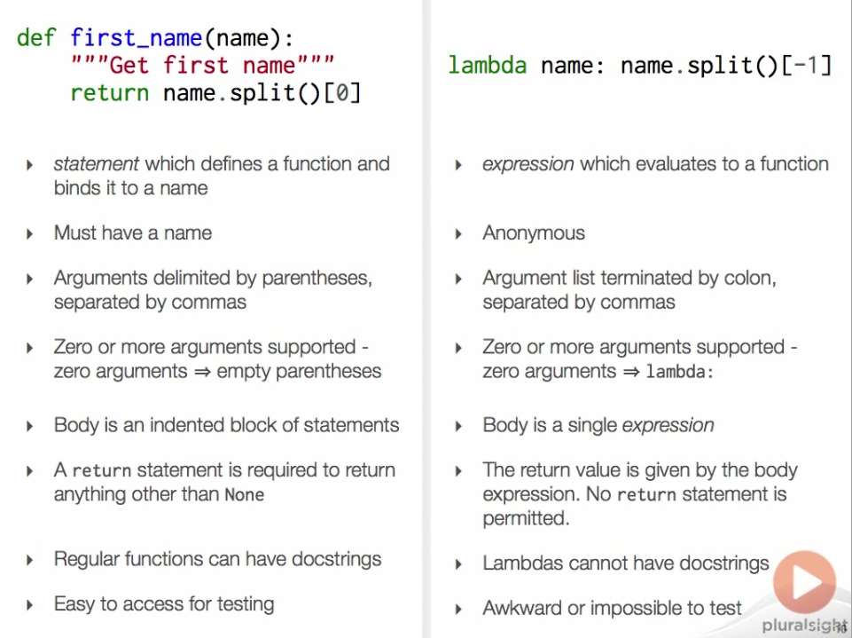

# Functions

```python
def function_name(arg1, arg2, arg3=1.0):
    """Function docstring"""
    print("Function body")
    return (arg1 + arg2) / arg3
```

Functions are objects, meaning they are callable:

```
>>> import socket
>>> def resolve(host):
...     return socket.gethostbyname(host)
...
>>> resolve
<function resolve at 0x...>
>>>
>>> resolve('sixty-north.com')
'93.93.131.30'
```

# Callable Instances and the `__call__()` Special Method

```
>>> from resolver import Resolver
>>> resolve = Resolver()
>>> resolve('sixty-north.com')
'93.93.131.30'
>>> resolve.__call__('sixty-north.com')
'93.93.131.30'
>>> resolve._cache
{'sixty-north.com': '93.93.131.30'}
>>> resolve('pluralsight.com')
'52.10.95.126'
>>> resolve._cache
{'pluralsight.com': '52.10.95.126', 'sixty-north.com': '93.93.131.30'}
```

Time the function call speed and compare it with the caching mechanism:

```
>>> from timeit import timeit
>>> timeit(setup="from __main__ import resolve", stmt="resolve('python.org')", number=1)
0.004410736000863835
>>> timeit(setup="from __main__ import resolve", stmt="resolve('python.org')", number=1)
3.767001544474624e-06
>>> print("{:f}".format(_))
0.000004
>>> exit()
```


# Callable classes

```
>>> def sequence_class(immutable):
...     if immutable:
...         cls = tuple
...     else:
...         cls = list
...     return cls
... 
>>> seq = sequence_class(immutable=True)
>>> t = seq("Timbuktu")
>>> t
('T', 'i', 'm', 'b', 'u', 'k', 't', 'u')
>>> type(t)
<class 'tuple'>
```


# Conditionals

Conditional **statement**:

```python
if condition:
    result = true_value
else:
    result = false_value
```

Conditional **expression**:

```python
result = true_value if condition else false_value
```


# Lambdas

Church developed the lambda calculus implemented in LISP

```
>>> scientists = ['Marie Curie', 'Albert Einstein', 'Niels Bohr', 'Isaac Newton', 'Dmitri Mendeleev', 'Antoine Laviosier', 'Carl Linnaeus', 'Alfred Wegener']
>>> 
>>> sorted(scientists, key=lambda name: name.split()[-1])
['Niels Bohr', 'Marie Curie', 'Albert Einstein', 'Antoine Laviosier', 'Carl Linnaeus', 'Dmitri Mendeleev', 'Isaac Newton', 'Alfred Wegener']
>>> 
>>> last_name = lambda name: name.split()[-1]
>>> last_name
<function <lambda> at 0x7f6973db3bf8>
>>> last_name('Nikola Tesla')
'Tesla'
>>> 
>>> def first_name(name):
...     return name.split()[0]
... 
>>> first_name
<function first_name at 0x7f6973cc56a8>
```




# Extended **formal** argument syntax

```python
def extended(*args, **kwargs):
```

## Arguments (`*args`)

### Erroneous

```
>>> def hypervolume(*lengths):
...     i = iter(lengths)
...     v = next(i)
...     for length in i:
...             v *= length
...     return v
... 
>>> hypervolume(2, 4)
8
>>> hypervolume(2, 4, 6)
48
>>> hypervolume(2, 4, 6, 8)
384
>>> hypervolume(1)
1
>>> hypervolume()
Traceback (most recent call last):
  File "<stdin>", line 1, in <module>
    File "<stdin>", line 3, in hypervolume
    StopIteration
```

As one can see, the error exposes a detail of the implementation our client should not be aware of. Look below on one method to fix this.

### Corrected: require positional argument

``` 
>>> def hypervolume(length, *lengths):
...     v = length
...     for item in lengths:
...             v *= item
...     return v
... 
>>> hypervolume(3, 5, 7, 9)
945
>>> hypervolume(3, 5, 7)
105
>>> hypervolume(3, 5)
15
>>> hypervolume(3)
3
>>> hypervolume()
Traceback (most recent call last):
  File "<stdin>", line 1, in <module>
  TypeError: hypervolume() missing 1 required positional argument: 'length'
```

## Key Word Arguments (`**kwargs`)

### Examples

```
>>> def tag(name, **kwargs):
...     print(name)
...     print(kwargs)
...     print(type(kwargs))
... 
>>> tag('img', src='monet.jpg', alt='Sunrise by Claude Monet', border=1)
img
{'alt': 'Sunrise by Claude Monet', 'border': 1, 'src': 'monet.jpg'}
<class 'dict'>
```

```
>>> def tag(name, **attributes):
...     result = '<' + name
...     for key, value in attributes.items():
...             result ++ ' {k}="{v}"'.format(k=key,v=str(value))
...     result += '>'
...     return result
...
>>> tag('img', src='monet.jpg', alt='Sunrise by Claude Monet', border=1)
''
```

## Comparisons

### Valid

```
>>> def print_args(arg1, arg2, *args):
...     print(arg1)
...     print(arg2)
...     print(args)
... 
>>> print_args(1,2,3,4,5)
1
2
(3, 4, 5)
```

```
>>> def print_args(arg1, arg2, *args, kwarg1, kwarg2):
...     print(arg1)
...     print(arg2)
...     print(args)
...     print(kwarg1)
...     print(kwarg2)
... 


>>> print_args(1,2,3,4,5,6,7)
Traceback (most recent call last):
File "<stdin>", line 1, in <module>
TypeError: print_args() missing 2 required keyword-only arguments: 'kwarg1' and 'kwarg2'


>>> print_args(1,2,3,4,5,kwarg1=6,kwarg2=7)
1
2
(3, 4, 5)
6
7
```

```
>>> def print_args(arg1, arg2, *args, kwarg1, kwarg2, **kwargs):
...     print(arg1)
...     print(arg2)
...     print(args)
...     print(kwarg1)
...     print(kwarg2)
...     print(kwargs)
...


>>> def print_args(arg1, arg2, *args, kwarg1, kwarg2, kwarg3=8, kwarg4=9)
  File "<stdin>", line 1
      def print_args(arg1, arg2, *args, kwarg1, kwarg2, kwarg3=8, kwarg4=9)
                                                                          ^
SyntaxError: invalid syntax


>>> print_args(1,2,3,4,5,kwarg1=6,kwarg2=7,kwarg3=8,kwarg4=9)    
1
2
(3, 4, 5)
6
7
{'kwarg4': 9, 'kwarg3': 8}


>>> def print_args(arg1, arg2, *args, kwarg1, kwarg2, **kwargs, kwargs99):
  File "<stdin>", line 1
      def print_args(arg1, arg2, *args, kwarg1, kwarg2, **kwargs, kwargs99):
                                                                    ^
SyntaxError: invalid syntax
```

# Extended **actual** formal syntax

```
>>> def print_args(arg1, arg2, *args):
...     print(arg1)
...     print(arg2)
...     print(args)
... 
>>> t = (11, 12, 13, 14)
>>> print_args(*t)
11
12
(13, 14)
```

```
>>> def color(red, green, blue, **kwargs):
...     print("r =", red)
...     print("g =", green)
...     print("b =", blue)
...     print(kwargs)
... 
>>> k = {'red':21, 'green':68, 'blue':120, 'alpha':52}
>>> color(**k)
r = 21
g = 68
b = 120
{'alpha': 52}
```

```
>>> def trace(f, *args, **kwargs):
...     print("args =", args)
...     print("kwargs =", kwargs)
...     result = f(*args, **kwargs)
...     print("result =", result)
...     return result
... 
>>> int("ff", base=16)
255
>>> trace(int, "ff", base=16)
args = ('ff',)
kwargs = {'base': 16}
result = 255
255
```

===


# Summary

- Functions can be generalized into the notion of callables
- We can make callable objects from instances by implementing the special `__call__()` method (we can then evoke the object as if it were a function)
- We use this technique to define functions with state such as caches between calls
- Attributes and methods can be used to query or modify any hidden state
- Whenever we create an object by evoking the constructor, we are actually calling a `class` object (which are callable themselves)
- `class` objects can be used just like any other callable object, include to being passed to and returned from functions
- lambda is most frequently used in-line and passed directly as arguments to other functions
- lambda argument list isn't enclosed in paranthesis
- callable objects can be detected using the built-in `callable` predicate funciion
- extended argument syntax allows arbitrary positional arguments to be accepted using the `*args` syntax and the callable definition, which results in the arguments being packaged into a tuple
- arbitray keyword arguments can be accepted using the `**kwargs` syntax, which results in keyword arguments being packaged into a dictionary
- Extended call syntax allows us to unpack iterable series and mappings into the positional and keyword function arguments respectfully
- There are no requirements for the use of `*args / **kwargs` at the call site to correspond to the `*args / **kwargs` in the definition
- Arguments will be unpacked and repackged as necessary
- `*args / **kwargs` can be combined with mandatory positional and keyeword arguments in a well-defined order
- In passing, we discovered that the `timeit` module can be used to meausre the performance of small code snippets
- Python supports the syntax for conditional expressions of the form `result = ... if condition else false_value`
- By combining `zip` with extended call syntax using `*args` and packing an iterable, series we can transpose two dimensional tables of data, converting rows into columns and vice versa
