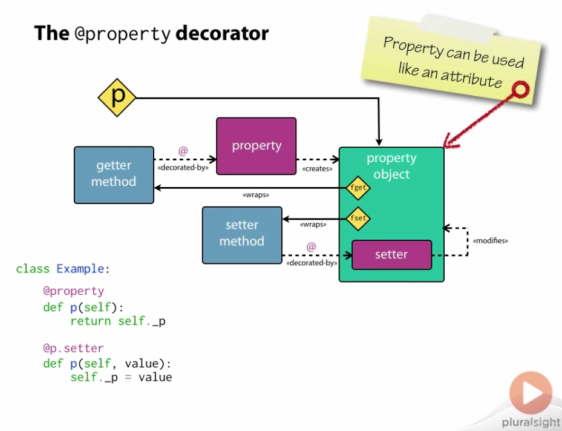
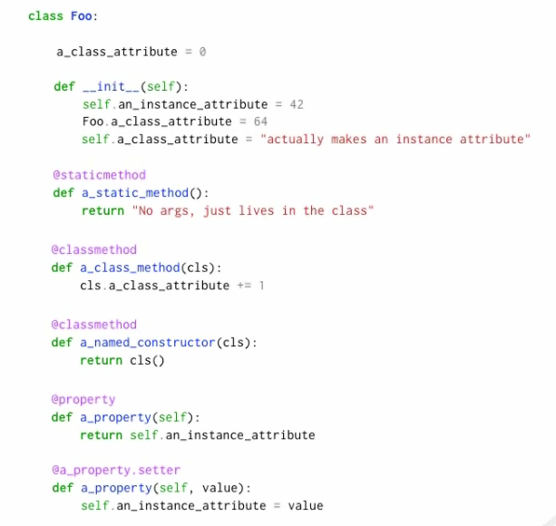

# Assignment to attributes

`self.attr = something`

**always** creates an *instance* attribute, never a *class* attribute

# Static methods

`@staticmethod`:

- No access needed to either *class* or *instance* objects
- Most likely an implementation detail of the class
- May be able to be moved to become a module-scope function

`@classmethod`:

- Requires access to the class object to call other class methods or the constructor

## Static methods with **inheritance**

Unlike static methods in many other languages, static methods in Python can be overriden in subclasses.

# **Encapsulation** using the `@property` method

The `@property` method can transform getter methods as if they were called as attributes.

This prevents the client from being able to explicitly override a "private" instance value of the class using `=`.

===

# Summary

