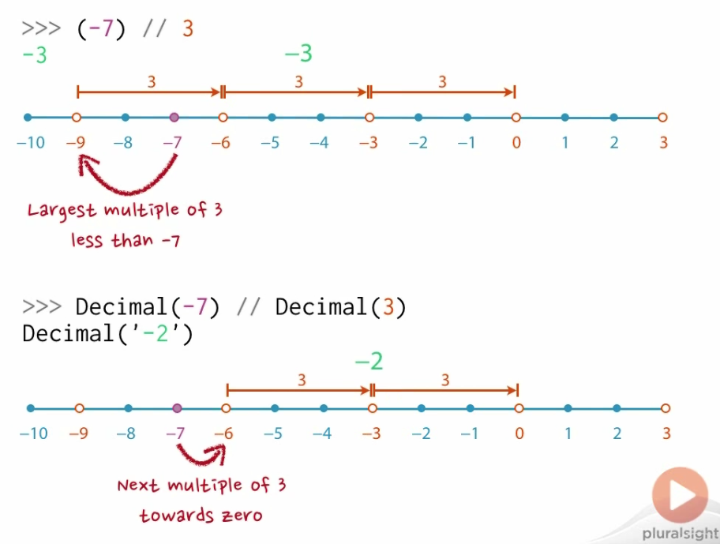
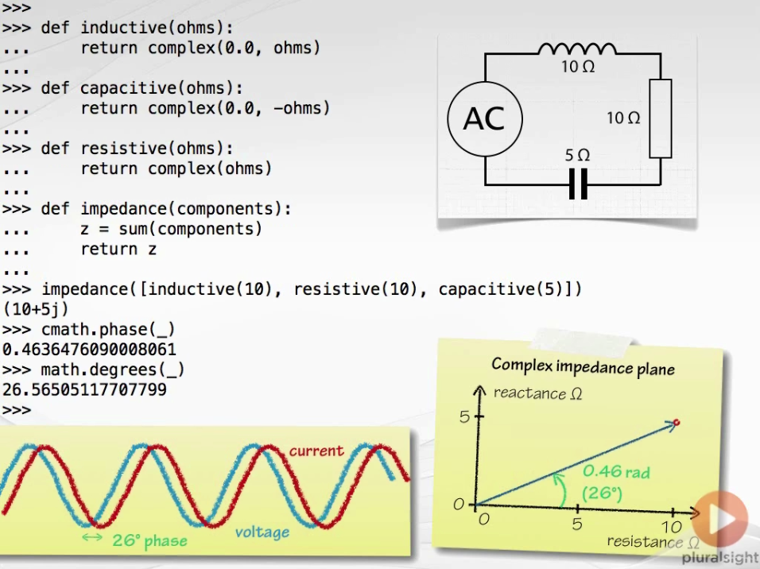
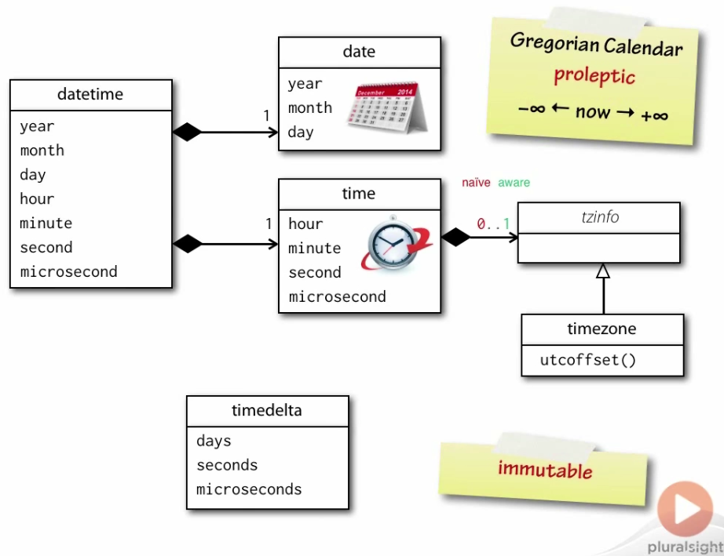

# `int`

Unlimited precision signed integer.


# `float`

- IEEE-754 double precision (64-bit)
- 53 bits of binary precision
    - 1 is allocated to the sign of the number
    - 11 is allocated for the exponent
    - 52 is allocated for the fraction
- 15 to 17 bits of decimal precision

```
>>> import sys
>>> sys.float_info
sys.float_info(max=1.7976931348623157e+308, max_exp=1024, max_10_exp=308, min=2.2250738585072014e-308, min_exp=-1021, min_10_exp=-307, dig=15, mant_dig=53, epsilon=2.220446049250313e-16, radix=2, rounds=1)
>>>
>>> most_negative_float = -sys.float_info.max
>>> most_negative_float
-1.7976931348623157e+308
>>> 
>>> greatest_negative_float = -sys.float_info.min
>>> greatest_negative_float
-2.2250738585072014e-308
```

Never assume that you can convert `int` in Python without any loss of information.

```
>>> 2 ** 53
9007199254740992
>>> float(2 ** 53)
9007199254740992.0
>>> 
>>> float(2 ** 53 + 1)
9007199254740992.0
>>> float(2 ** 53 + 2)
9007199254740994.0
>>> float(2 ** 53 + 3)
9007199254740996.0
>>> float(2 ** 53 + 4)
9007199254740996.0
```

[What Every Computer Scientist Should Know About Floating-Point Arithmetic](https://ece.uwaterloo.ca/~dwharder/NumericalAnalysis/02Numerics/Double/paper.pdf)


***

# `decimal`

The standard library **module** containing the class **Decimal** 

- decimal floating point
- configurable (although finite) precision
- defaults to 28 digits of decimal precision

```
>>> import decimal
>>> decimal.getcontext()
Context(prec=28, rounding=ROUND_HALF_EVEN, Emin=-999999999, Emax=999999999, capitals=1, flags=[], traps=[InvalidOperation, DivisionByZero, Overflow])
```

```
>>> from decimal import Decimal
>>> Decimal(7)
Decimal('7')
>>> 
>>> Decimal('0.8')  # constructor also accepts strings
Decimal('0.8')
>>> Decimal('0.8') - Decimal('0.7')
Decimal('0.1')
>>> 
>>> Decimal(0.8) - Decimal(0.7)  # rounding due to base-2 inprecision
Decimal('0.1000000000000000888178419700')
```

Always **quote** literal fractional values to avoid inexact intermediate base-2 float objects.


Significant Digits Precision:

```
>>> decimal.getcontext().prec = 6  # six significant digits
>>> d = Decimal('1.234567')
>>> d + Decimal(1)
Decimal('2.23457')
```

Invalid + Infinity:

```
>>> Decimal('Infinity')
Decimal('Infinity')
>>> Decimal('-Infinity')
Decimal('-Infinity')
>>> Decimal('NaN')
Decimal('NaN')
>>> 
>>> Decimal('NaN') + Decimal('1.414')
Decimal('NaN')
>>> Decimal('1.4') + 0.6
    ...
TypeError: unsupported operand type(s) for +: 'Decimal' and 'float'
```

Module Operations:

```
>>> (-7) % 3
2
>>> Decimal(-7) % Decimal(3)
Decimal('-1')
```

```
>>> def is_odd(n):
...     return n % 2 == 1
... 
>>> is_odd(2)
False
>>> is_odd(3)
True
>>> is_odd(-2)
False
>>> is_odd(-3)
True
>>> is_odd(2.0)
False
>>> is_odd(-2.0)
False
>>> is_odd(-3.0)
True
>>> is_odd(Decimal(2))
False
>>> is_odd(Decimal(3))
True
>>> is_odd(Decimal(-2))
False
>>> is_odd(Decimal(-3))
False
>>> Decimal(-3) % 2
Decimal('-1')
>>> 
>>> 
>>> def is_odd(n):
...     return n % 2 != 0
... 
>>> is_odd(Decimal(-3))
True
```

The important **identity** is preserved

`x == (x // y) * y + x % y`

so **integer division** and **modulus** are consistent.





***

# `fractions`

The standard library **module** containing the class `Fraction` for **rational** numbers

- 2/3
- 4/5


Basics: 

```
>>> from fractions import Fraction
>>> two_thirds = Fraction(2, 3)
>>> two_thirds
Fraction(2, 3)
>>> four_fifths = Fraction(4, 5)
>>> four_fifths
Fraction(4, 5)
>>> 
>>> Fraction(5, 0)
    ...
    raise ZeroDivisionError('Fraction(%s, 0)' % numerator)
ZeroDivisionError: Fraction(5, 0)
>>> 
>>> Fraction(999999999999999999999999999999999)
Fraction(999999999999999999999999999999999, 1)
```

Convert from float:

```
>>> Fraction(0.5)
Fraction(1, 2)
>>> Fraction(0.1)
Fraction(3602879701896397, 36028797018963968)
>>> Fraction(Decimal('0.1'))
Fraction(1, 10)
```

Literal string with `/` as separator

```
>>> Fraction('22/7')
Fraction(22, 7)
```

Arithmetic operations:

```
>>> Fraction(2,3) + Fraction(4,5)
Fraction(22, 15)
>>> Fraction(2,3) - Fraction(4,5)                                                                                    
Fraction(-2, 15)
>>> Fraction(2,3) * Fraction(4,5)                                                                                    
Fraction(8, 15)
>>> Fraction(2,3) / Fraction(4,5)                                                                                    
Fraction(5, 6)
>>> Fraction(2,3) // Fraction(4,5)
0
>>> Fraction(2,3) % Fraction(4,5)                                                                                    
Fraction(2, 3)
>>> 
>>> from math import floor
>>> floor(Fraction('4/3'))
1.0
```


***


# `complex`

The **built-in** type for **complex** numbers

Python uses the electrical engineering notation for imaginary numbers $j = sqrt{-1}$

**Complex construction**: string argument *may* have parantheses but *must not* contain spaces

```
>>> 2j
2j
>>> 3 + 4j
(3+4j)
>>> type(3 + 4j)
<type 'complex'>
>>> complex(3)
(3+0j)
>>> complex(-2, 3)
(-2+3j)
>>> complex('-(2+3j)')  # can't negate parantheses
    ...
ValueError: complex() arg is a malformed string
>>> complex('(-2+3j)')
(-2+3j)
>>> complex('-2+3j')
(-2+3j)
>>> complex('-2 + 3j')  # no white spaces allowed
    ...
ValueError: complex() arg is a malformed string
```

Square root functions:

```
>>> import cmath
>>> cmath.sqqrt(-1)
    ...
AttributeError: 'module' object has no attribute 'sqqrt'
>>> cmath.sqrt(-1)
1j
```

```
>>> cmath.phase(1+1j)
0.7853981633974483
>>>
>>> abs(1+1j)
1.4142135623730951
>>> 
>>> cmath.polar(1+1j)
(1.4142135623730951, 0.7853981633974483)
>>> 
>>> modulus, phase = cmath.polar(1+1j)
>>> modulus
1.4142135623730951
>>> phase
0.7853981633974483
>>> 
>>> cmath.rect(modulus, phase)
(1.0000000000000002+1j)
```

Circuit exmaple using Python:




***


# `abs()`

The **built-in** function gives the **distance** from zero


# `round()`

The **built-in** function performs **decimal** rounding for all scalar number types

Can show *surprising* behavior with `float` values which can't be represented *exactly* in binary.

```
>>> round(0.2812, 3)
0.281
>>> round(0.625, 1)
0.6
>>> round(Decimal('3.25'), 1)
3.3
>>> round(Fraction(57, 100), 2)
0.57
>>> round(Fraction(57, 100), 1)
0.6
>>> round(Fraction(57, 100), 0)
1.0
>>> round(2.675, 2)
2.67
```


***


# Number Base Conversions

`bin()`: base 2

`oct()`: base 8

`hex()`: base 16

`int(x, base)`: 

- bases 2 to 36
- uses `0-9` and `a-z` for digits in bases from 2 to 36
- specifying *base zero* uses the *base prefix*, defaulting to decimal
- No support for base one (tallying)

```
>>> 0b101010
42
>>> 0o52
42
>>> 0x2a
42
>>> bin(42)
'0b101010'
>>> oct(42)
'052'
>>> hex(42)
'0x2a'
>>> hex(42)[2:]  # remove prefix with string slicing
'2a'
>>> int("2a", base=16)
42
>>> int("acghd", base=18)
1125247
>>> int("0b111000", base=2)
56
>>> int("0o664", base=0)
436
```


***


# `datetime`



- year: [1, 9999]
- month: [1, 12]
- day: [1, 31]

```
>>> import datetime
>>> datetime.date(2014, 1, 6)
datetime.date(2014, 1, 6)
>>> datetime.date(year=2014, month=1, day=6)
datetime.date(2014, 1, 6)
>>> datetime.date.today()
datetime.date(2016, 2, 24)
>>> datetime.date.fromtimestamp(1000000000)
datetime.date(2001, 9, 9)
>>> datetime.date.fromordinal(720669)
datetime.date(1974, 2, 15)
>>> 
>>> d = datetime.date.today()
>>> d.year
2016
>>> d.month
2
>>> d.day
24
```

Weekdays:

`weekday()`:

- 0: Monday
- 1: Tuesday
- 2: Wednesday
- 3: Thursday
- 4: Friday
- 5: Saturday
- 6: Sunday

`isoweekday()`:

- 1: Monday
- 2: Tuesday
- 3: Wednesday
- 4: Thursday
- 5: Friday
- 6: Saturday
- 7: Sunday

**ISO 8601:2004**: representation of dates and times

```
>>> d.weekday()
2
>>> d.isoweekday()
3
>>> d.isoformat()
'2016-02-24'
```

`strftime()`: **str**-ing-**f**-ormat-**time** 

```
>>> d.strftime('%A %d %B %Y')
'Wednesday 24 February 2016'
>>> 
>>> "The date is {:%A %d %B %Y}".format(d)
'The date is Wednesday 24 February 2016'
>>> 
>>> e = datetime.date(2014, 1, 6)
>>> e.strftime('%A %-d %B %Y')
'Monday 6 January 2014'
>>> 
>>> "{date:%A} {date.day} {date:%B} {date.year}".format(date=e)
'Monday 6 January 2014'
>>> 
>>> datetime.date.min
datetime.date(1, 1, 1)
>>> datetime.date.max
datetime.date(9999, 12, 31)
>>> datetime.date.resolution
datetime.timedelta(1)
```

time: 

```
>>> datetime.time(3)  # 3 hours
datetime.time(3, 0)
>>> datetime.time(3, 1)  # 3 hours and 1 minute
datetime.time(3, 1)
>>> datetime.time(3, 1, 2)  # 3 hours, 1 minute, and 2 seconds
datetime.time(3, 1, 2)
>>> datetime.time(3, 1, 2, 232)  # 3 hours, 1 minute, 2 seconds, and 232 microseconds
datetime.time(3, 1, 2, 232)
>>> datetime.time(hour=23, minute=59, second=59, microsecond=999999)
datetime.time(23, 59, 59, 999999)
```

Decomposing the data format:

```
>>> t = datetime.time(10, 32, 47, 675623)
>>> t.hour
10
>>> t.minute
32
>>> t.second
47
>>> t.microsecond
675623
```

Isoformats and `strftime()`:

```
>>> t.isoformat()
'10:32:47.675623'
>>> 
>>> t.strftime('%Hh%Mm%Ss')
'10h32m47s'
>>> 
>>> "{t.hour}h{t.minute}m{t.second}s".format(t=t)
'10h32m47s'
>>> 
>>> datetime.time.min
datetime.time(0, 0)
>>> datetime.time.max
datetime.time(23, 59, 59, 999999)
>>> datetime.time.resolution
datetime.timedelta(0, 0, 1)
```

Various methods:

```
>>> import datetime
>>> 
>>> datetime.datetime(2003, 5, 12, 14, 33, 22, 245323)
datetime.datetime(2003, 5, 12, 14, 33, 22, 245323)
>>> 
>>> datetime.datetime.today()
datetime.datetime(2016, 2, 24, 18, 25, 3, 435035)
>>> datetime.datetime.now()
datetime.datetime(2016, 2, 24, 18, 25, 7, 336652)
>>> datetime.datetime.utcnow()
datetime.datetime(2016, 2, 24, 10, 25, 27, 635183)
>>> datetime.datetime.fromordinal(5)
datetime.datetime(1, 1, 5, 0, 0)
>>> datetime.datetime.fromtimestamp(3635352)
datetime.datetime(1970, 2, 12, 9, 49, 12)
>>> datetime.datetime.utcfromtimestamp(3635352)
datetime.datetime(1970, 2, 12, 1, 49, 12)
>>> 
>>> d = datetime.date.today()
>>> t = datetime.time(8, 15)
>>> datetime.datetime.combine(d, t)
datetime.datetime(2016, 2, 24, 8, 15)
```

`strptime()`: **str**ing-**p**arse-**time**

```
>>> dt = datetime.datetime.strptime("Monday 6 January 2014, 12:13:21",
...                                 "%A %d %B %Y, %H:%M:%S")
>>> dt
datetime.datetime(2014, 1, 6, 12, 13, 21)
>>> 
>>> dt.date()
datetime.date(2014, 1, 6)
>>> dt.time()
datetime.time(12, 13, 21)
>>> 
>>> dt.day
6
>>> dt.isoformat()
'2014-01-06T12:13:21'
```

# `timedelta`:

Constructor accepts and **sums**:

- days
- seconds
- microseconds
- milliseconds
- minutes
- hours
- weeks

Instances **store** only:

- days
- seconds
- microseconds


```
seconds=1, microseconds=1000)
datetime.timedelta(0, 0, 2000)
>>> td = datetime.timedelta(weeks=1, minutes=2, milliseconds=5500)
>>> td
datetime.timedelta(7, 125, 500000)
>>> td.days
7
>>> td.seconds
125
>>> td.microseconds
500000
>>> 
>>> str(td)
'7 days, 0:02:05.500000'
>>> repr(td)
'datetime.timedelta(7, 125, 500000)'
```

# Arithmetic with `datetime`

```
>>> a = datetime.datetime(year=2014, month=5, day=8, hour=14, minute=22)
>>> b = datetime.datetime(year=2014, month=3, day=14, hour=12, minute=9)
>>> a - b
datetime.timedelta(55, 7980)
>>> d = a - b
>>> d
datetime.timedelta(55, 7980)
>>> d.total_seconds()
4759980.0
>>> 
>>> datetime.date.today() + datetime.timedelta(weeks=1) * 2  # date 2 weeks from now
datetime.date(2016, 3, 9)
```

# Time Zones

**PYTHON 3 ONLY**:

```
>>> cet = datetime.timezone(datetime.timedelta(hours=1), "CET")
>>> cet
datetime.timezone(datetime.timedelta(0, 3600), 'CET')
>>> 
>>> departure = datetime.datetime(year=2014, month=1, day=7,
...                               hour=11, minute=30, tzinfo=cet)
>>> 
>>> arrival = datetime.datetime(year=2014, month=1, day=7,
...                             hour=13, minute=5,
...                             tzinfo=datetime.timezone.utc)
>>> arrival - departure
datetime.timedelta(0, 9300)
>>> str(arrival - departure)
'2:35:00'
```

***


# Floating Point Versus Rational Numbers

Boolean values:

```
>>> False - False
0
>>> False - True
-1
>>> True - False
1
>>> True - True
0
>>> 
>>> def sign(x):
...     return (x > 0) - (x < 0)    
... 
>>> 
>>> sign(-5)
-1
>>> sign(0)
0
>>> sign(5)
1
```

Collinearity:

```
>>> def orientation(p, q, r):
...     d = (q[0] - p[0]) * (r[1] - p[1]) - (q[1] - p[1]) * (r[0] - p[0])
...     return sign(d)
...     
... 
>>> a = (0, 0)
>>> b = (4, 0)
>>> c = (4, 3)
>>> 
>>> orientation(a, b, c)
1
>>> 
>>> orientation(a, c, b)
-1
>>> 
>>> d = (8, 6)  # collinear
>>> orientation(a, c, d)
0
```
