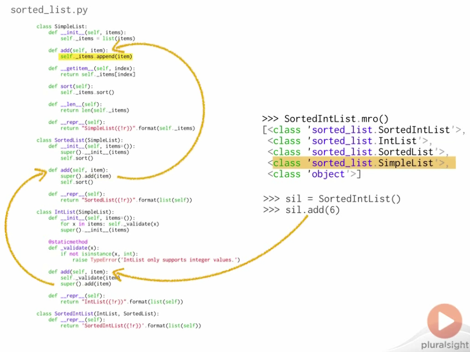

# Single Inheritance

`class SubClass(BaseClass)`

- Subclasses will want to initialize base classes
- Base class initializer will only be called automatically if subclass initializer is undefined

## Calling base class initiailizer

- Other languages automatically call base class initializers
- Python treats `__init__()` like any other method
- Base class `__init__()` is not called if overridden
- User `super()` to call base class `__init__()`


# Multiple Inheritance

Defining a class with more than one base class.

Python has a relatively simple and understandable system for multiple inheritance.

`class SubClass(Base1, Base2, ...)`

- Subclasses **inherit** methods of all bases
- Without conflict, names **resolve** in the obvous way - **Method Resolution Order (MRO)** determines name lookup in class - How does Python know which `add()` to call?
    - How does Python maintain both constraints?

## `isinstance()`

Determines if an object is of a specific type

Use `isinstance()` for runtime type checking.

```
>>> isinstance(3, int)
True
>>> isinstance('hello!', str)
True
>>> isinstance(4.567, bytes)
False
>>> isinstance(sl, SortedList)
True
>>> isinstance(sl, SimpleList)  # true for base class
True
>>> x = []
>>> isinstance(x, (float, dict, list))  # equivalent to ` type(x) in (float, dict, list)`
True
```

## `issublcass()`

Determines if one type is a subclass of another.

```
>>> from sorted_list import *
>>> issubclass(IntList, SimpleList)
True
>>> issubclass(SortedList, IntList)
False
```

## Note

If a class

A. has **multiple** base classes
B. defines **no initializer**

then **only** the initializer of the **first** base class is automatically called

## `__bases__`

```
>>> from sorted_list import SortedIntList, IntList
>>> SortedIntList.__bases__
(<class 'sorted_list.IntList'>, <class 'sorted_list.SortedList'>)
>>> IntList.__bases__
(<class 'sorted_list.SimpleList'>)
```

---

# Method Resolution Order

Ordering that determines method name lookup

- Commonly called "MRO"
- Methods may be defined in mutliple places
- MRO is an ordering of the inheritance graph
- Actually quite simple

```
>>> from sorted_list import SortedIntList
>>> SortedIntList.__mro__
(<class 'sorted_list.SortedIntList'>, <class 'sorted_list.IntList'>, <class 'sorted_list.SortedList'>, <class 'sorted_list.SimpleList'>, <class 'object'>)
>>> ["{}.{}".format(c.__module__, c.__name__) for c in SortedIntList.mro()]
['sorted_list.SortedIntList', 'sorted_list.IntList', 'sorted_list.SortedList', 'sorted_list.SimpleList', 'builtins.object']
```

How is `IntList.add()` deferring to `SortedList.add()`?


# `C3`

Algorithm for calculating MRO in Python

- Subclases come **before** base classes
- Base class order from class definition is **preserved**
- First two qualities are preserved **no matter** where you start in the inheritance graph

```
>>> class A: pass
... 
>>> class B(A): pass
... 
>>> class C(A): pass
... 
>>> class D(B, A, C): pass
... 
Traceback (most recent call last):
  File "<stdin>", line 1, in <module>
TypeError: Cannot create a consistent method resolution
order (MRO) for bases C, A
```


# `super()`

Given a ***method resolution order*** and a class `C`, `super()` gives you an object which resolves methods using only the part of the *MRO* which comes after `C`.

In other words, `super()` doesn't work with the base classes of a class, but instead it works for the MRO of the type of the object on which the method was originally invoked.

`super()` returns a **proxy** object which **routes** method calls.

## Bound proxy

Bound to a specific class or instance

### Instance-bound

`super(class, instance_of_class)`

- Finds the MRO for the type of the second argument
- Finds the location of the first argument in the MRO
- Uses everything *after* that for resolving methods

```
>>> from sorted_list import *
>>> from pprint import pprint as pp
>>> pp(SortedIntList.mro())
[<class 'sorted_list.SortedIntList'>,
 <class 'sorted_list.IntList'>,
 <class 'sorted_list.SortedList'>,
 <class 'sorted_list.SimpleList'>,
 <class 'object'>]
>>> 
>>> sil = SortedIntList([5, 15, 10])
>>> sil
SortedIntList([5, 10, 15])
>>> 
>>> super(SortedList, sil)
<super: <class 'SortedList'>, <SortedIntList object>>
>>> 
>>> super(SortedList, sil).add(6)
>>> sil
SortedIntList([5, 10, 15, 6])
>>> super(SortedList, sil).add("I'm not a number! I'm a free man!")
>>> sil
SortedIntList([5, 10, 15, 6, "I'm not a number! I'm a free man!"])
```

### Class-bound

`super(base_class, derived_class)`

- Python finds MRO for `derived_class`
- It then finds `base_class` in that MRO
- It takes everything *after* `base_class` in the MRO, and finds the first class in that sequence with a matching method name

-mro.png)

```
>>> from sorted_list import *
>>> SortedIntList.mro()
[<class 'sorted_list.SortedIntList'>, <class 'sorted_list.IntList'>, <class 'sorted_list.SortedList'>, <class 'sorted_list.SimpleList'>, <class 'object'>]
>>> super(SortedList, SortedIntList)
<super: <class 'SortedList'>, <SortedIntList object>>
>>> super(SortedList, SortedIntList).add
<function SimpleList.add at ...>
>>> super(SortedList, SortedIntList).add(4)
Traceback (most recent call last):
  ...
TypeError: add() missing 1 required positional argument: 'item'
```

## Unbound proxy

Not bound to a class or instance


## Calling `super()` without arguments

**instance** method: `super(class_of_method, self)`
**class** method:    `super(class_of_method, class)`

## REVIEW

`super()` uses **everything** after a specific class in a MRO to **resolve** method calls, which ae all bundled up into proxy objects which will return from the `super()` call.

Q: So *how* does `SortedIntList` work?

A: Both classes use `super()` instead of **direct** base classes references




---


# object

- The core of the Python **objec model**.
- `object` is the **ultimate** base class of every class.
- `object` is automatically added as a base class

```
>>> class NoBaseClass: pass
... 
>>> NoBaseClass.__bases__
(<class 'object'>,)
>>> dir(object)
['__class__', '__delattr__', '__dir__', '__doc__', '__eq__', '__format__', '__ge__', '__getattribute__', '__gt__', '__hash__', '__init__', '__le__', '__lt__', '__ne__', '__new__', '__reduce__', '__reduce_ex__', '__repr__', '__setattr__', '__sizeof__', '__str__', '__subclasshook__']
```


