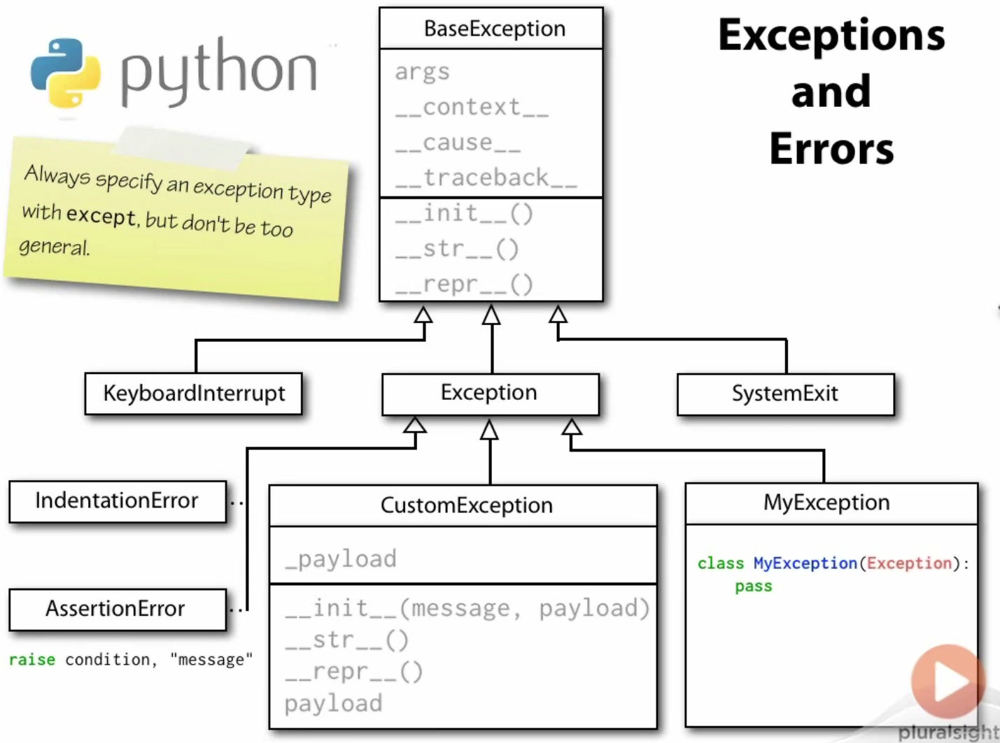

# [Hierarchy of Built-in Exceptions]

Exceptions are arranged in an **inheritance** hierarchy.

```
>>> IndexError.mro()
[<class 'IndexError'>, <class 'LookupError'>, <class 'Exception'>, <class 'BaseException'>, <class
'object'>]
>>> 
>>> KeyError.mro()
[<class 'KeyError'>, <class 'LookupError'>, <class 'Exception'>, <class 'BaseException'>, <class
'object'>]
```

## Python 2.7

```
BaseException
 +-- SystemExit
 +-- KeyboardInterrupt
 +-- GeneratorExit
 +-- Exception
      +-- StopIteration
      +-- StandardError
      |    +-- BufferError
      |    +-- ArithmeticError
      |    |    +-- FloatingPointError
      |    |    +-- OverflowError
      |    |    +-- ZeroDivisionError
      |    +-- AssertionError
      |    +-- AttributeError
      |    +-- EnvironmentError
      |    |    +-- IOError
      |    |    +-- OSError
      |    |         +-- WindowsError (Windows)
      |    |         +-- VMSError (VMS)
      |    +-- EOFError
      |    +-- ImportError
      |    +-- LookupError
      |    |    +-- IndexError
      |    |    +-- KeyError
      |    +-- MemoryError
      |    +-- NameError
      |    |    +-- UnboundLocalError
      |    +-- ReferenceError
      |    +-- RuntimeError
      |    |    +-- NotImplementedError
      |    +-- SyntaxError
      |    |    +-- IndentationError
      |    |         +-- TabError
      |    +-- SystemError
      |    +-- TypeError
      |    +-- ValueError
      |         +-- UnicodeError
      |              +-- UnicodeDecodeError
      |              +-- UnicodeEncodeError
      |              +-- UnicodeTranslateError
      +-- Warning
           +-- DeprecationWarning
           +-- PendingDeprecationWarning
           +-- RuntimeWarning
           +-- SyntaxWarning
           +-- UserWarning
           +-- FutureWarning
	   +-- ImportWarning
	   +-- UnicodeWarning
	   +-- BytesWarning
```

## Python 3+

```
BaseException
 +-- SystemExit
 +-- KeyboardInterrupt
 +-- GeneratorExit
 +-- Exception
      +-- StopIteration
      +-- ArithmeticError
      |    +-- FloatingPointError
      |    +-- OverflowError
      |    +-- ZeroDivisionError
      +-- AssertionError
      +-- AttributeError
      +-- BufferError
      +-- EOFError
      +-- ImportError
      +-- LookupError
      |    +-- IndexError
      |    +-- KeyError
      +-- MemoryError
      +-- NameError
      |    +-- UnboundLocalError
      +-- OSError
      |    +-- BlockingIOError
      |    +-- ChildProcessError
      |    +-- ConnectionError
      |    |    +-- BrokenPipeError
      |    |    +-- ConnectionAbortedError
      |    |    +-- ConnectionRefusedError
      |    |    +-- ConnectionResetError
      |    +-- FileExistsError
      |    +-- FileNotFoundError
      |    +-- InterruptedError
      |    +-- IsADirectoryError
      |    +-- NotADirectoryError
      |    +-- PermissionError
      |    +-- ProcessLookupError
      |    +-- TimeoutError
      +-- ReferenceError
      +-- RuntimeError
      |    +-- NotImplementedError
      +-- SyntaxError
      |    +-- IndentationError
      |         +-- TabError
      +-- SystemError
      +-- TypeError
      +-- ValueError
      |    +-- UnicodeError
      |         +-- UnicodeDecodeError
      |         +-- UnicodeEncodeError
      |         +-- UnicodeTranslateError
      +-- Warning
           +-- DeprecationWarning
           +-- PendingDeprecationWarning
           +-- RuntimeWarning
           +-- SyntaxWarning
           +-- UserWarning
           +-- FutureWarning
           +-- ImportWarning
           +-- UnicodeWarning
           +-- BytesWarning
           +-- ResourceWarning
```

---

# Exception Payloads

No restriction is placed upon what may be passed in for `args` for backward-compatibility reasons.
In practice, though, only a single string argument should be used.

# Chaining Exceptions

## Implicit chaining

`__context__`

## Explicit chaining

`from` keyword

---

# Tracebacks

`__traceback__`: special attribute that contains a reference to the traceback object associated with the exception

Don't keep references to `__traceback__` beyond the scope of the except block.

Prefer to render `__traceback__` to a string.

---

# Checking invariants with Assertions

`assert condition [,message]`

`False => AssertionError`

```
>>> assert False, "The condition is false"
Traceback (most recent call last):
  File "<stdin>", line 1, in <module>
AssertionError: The condition is false
>>> 
>>> assert 5 > 2, "You are in a defective universe!"  # message no effect
```

## Timing modules with and without active assertions

```
$ python3 -m timeit -n 1 -s "from random import randrange; from sorted_set import SortedSet; s = SortedSet(randrange(1000) for _ in range(2000)); [s.count(i) for i in range(1000)]"
1 loops, best of 3: 0.733 usec per loop

$ python3 -O -m timeit -n 1 -s "from random import randrange; from sorted_set import SortedSet; s = SortedSet(randrange(1000) for _ in range(2000)); [s.count(i) for i in range(1000)]"
1 loops, best of 3: 0.288 usec per loop
```

---

# Summary


