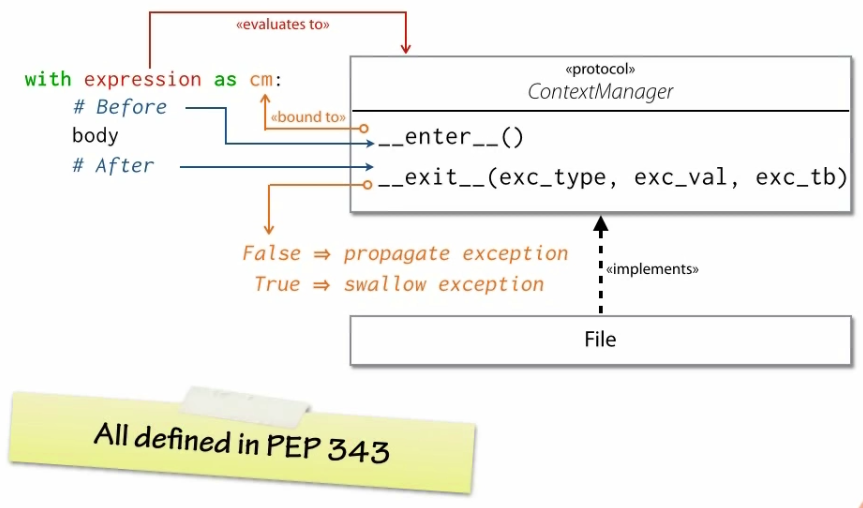

# Context Manager

An object designed to be used in a `with`-statement:

```python
with context-manager:
    context-manager.begin()  # setup | enter()
    body
    context-manager.end()    # teardown | exit()
```

A **context-manager** ensures that **resources** are properly and automatically **managed**.

- `enter()` prepares the manager for use
- `exit()` cleans it up

# Context Manager Protocol

```python
__enter__(self)

__exit__(self,
         exc_type,
         exc_val,
         exc_tb)
```

```python
with expression as x:
    body
```

If `__enter__()` is met with exceptions, `with`-statement is not executed to completion.

**IMPORTANT**: The value of `expression.__enter__()` is bound to `x`, not the value of `expression`.

## `__enter__()`

- called before entering `with`-statement body
- return value bound to `as variable`
- can return value of any type
- commonly returns context-manager itself

```sh
>>> f = open('a_file', 'w')
>>> with f as g:
...     print(f is g)
...
True
>>>
```

## `__exit__()`

- called when `with`-statement body exits
- can check `type` for `None` to see if an *exception was thrown*
- be default, propagates exceptions thrown from the `with`-statement's code block
- if returns `False`, the exception is propagated (answers the question "should the `with`-statement swallow exceptions?")
- should *NEVER* explicitly re-raise exceptions
- should *ONLY* raise exceptions if it fails itself

# [PEP 343](www.python.org/dev/peps/pep-0343)

---

# `contextlib`

Standard library module for working with context managers

> "... provides utilities for common tasks involving the `with` statement"

## `contextlib.contextmanager`

- A decorator you can youu use to create new context managers
- Lets you define context-managers with *simple* control flow
- Allows you to leverage the *statefulness* of generators
- Use standard exception handling to propagate exceptions
- Explicitly re-raise or don't catch to propagate exceptions
- Swallow exceptions by not re-raising them

```python
@contextlib.contextmanager
def my_context_manager():
    # <ENTER>
    try:
        yield [value]
        # <NORMAL EXIT>
    except:
        # <EXCEPTIONAL EXIT>
        raise

with my_context_manager() as x:
    # ...
```

---

# Multiple Context Managers

`with` statements can use as many context-managers as you need

```python
with cm1() as a, cm2() as b:
    BODY
```

is the same as

```python
with cm1() as a:
    with cm2() as b:
        BODY
```

Exceptions propagated from *inner* context managers will be seen by *outer* context managers.

## Examples

### [`nest.py`](./nest.py)

```python
>>> from nest import nest_test
>>> 
>>> with nest_test('outer') as n1, nest_test('inner, nested in ' + n1):
...     print('BODY')
... 
Entering outer
Entering inner, nested in outer
BODY
Exiting inner, nested in outer
Exiting outer
```

### [`prop.py`](./prop.py)

```sh
>>> from prop import *
>>> 
>>> with propagater('outer', True), propagater('inner', False):
...     raise TypeError('Cannot convert lead into gold')
... 
inner received an exception!
outer exited normally.
>>> with propagater('outer', False), propagater('inner', True):
...     raise TypeError('Cannot convert lead into gold')
... 
inner received an exception!
outer received an exception!
```

### Lists != Context Managers

```sh
>>> from nest import nest_test
>>> with [nest_test('a'), nest_test('b')]:
...     pass
...
Traceback (most recent call last):
    ...
AttributeError: __exit__
```

---

# Duck Tail Context Managers for Transactions

## [`db.connection`](./db/connection.py)

```python
>>> from db.connection import Connection, start_transaction
>>> conn = Connection()
>>> try:
...     with start_transaction(conn) as tx:
...         x = 1 + 1
...         raise ValueError()
...         y = x + 2
...         print('transaction 0 =', x, y)
... except ValueError:
...     print('Oops! Transaction 0 failed.')
... 
starting transaction 0
rolling back transaction 0
Oops! Transaction 0 failed.
>>> try:
...     with start_transaction(conn) as tx:
...         x = 1 + 1
...         y = x + 2
...         print('transaction 1 =', x, y)
... except ValueError:
...     assert False
... 
starting transaction 1
transaction 1 = 2 4
committing transaction 1
```

---

# Summary


