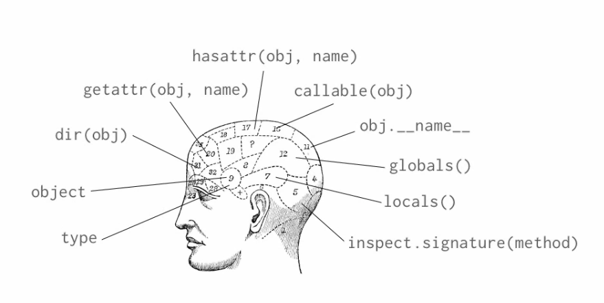

# Object Types in Depth

```sh
>>> i = 1
>>> type(i)
<class 'int'>
>>> int
<class 'int'>
>>> repr(int)
"<class 'int'>"
>>> type(i) is int
True
>>> type(i)(78)
78
>>> type(type(i))
<class 'type'>
>>> i.__class__
<class 'int'>
>>> i.__class__.__class__
<class 'type'>
>>> i.__class__.__class__.__class__
<class 'type'>
>>> issubclass(type, object)
True
>>> type(object)
<class 'type'>
>>> isinstance(i, int)
True
```

# Introspecting objects

```sh
>>> i = 1
>>> dir(i)
['__abs__', '__add__', '__and__', '__bool__', '__ceil__', '__class__', '__delattr__', '__dir__', '__divmod__', '__doc__', '__eq__', '__float__', '__floor__', '__floordiv__', '__format__', '__ge__', '__getattribute__', '__getnewargs__', '__gt__', '__hash__', '__index__', '__init__', '__int__', '__invert__', '__le__', '__lshift__', '__lt__', '__mod__', '__mul__', '__ne__', '__neg__', '__new__', '__or__', '__pos__', '__pow__', '__radd__', '__rand__', '__rdivmod__', '__reduce__', '__reduce_ex__', '__repr__', '__rfloordiv__', '__rlshift__', '__rmod__', '__rmul__', '__ror__', '__round__', '__rpow__', '__rrshift__', '__rshift__', '__rsub__', '__rtruediv__', '__rxor__', '__setattr__', '__sizeof__', '__str__', '__sub__', '__subclasshook__', '__truediv__', '__trunc__', '__xor__', 'bit_length', 'conjugate', 'denominator', 'from_bytes', 'imag', 'numerator', 'real', 'to_bytes']
>>> getattr(i, 'denominator')
1
>>> i.denominator
1
>>> getattr(i, 'conjugate')
<built-in method conjugate of int object at 0x9f4260>
>>> callable(getattr(i, 'conjugate'))
True
>>> i.conjugate.__class__.__name__
'builtin_function_or_method'
>>> getattr(i, 'index')
Traceback (most recent call last):
  File "<stdin>", line 1, in <module>
AttributeError: 'int' object has no attribute 'index'
>>> hasattr(i, 'bit_length')
True
>>> hasattr(i, 'index')
False
```

## Example ([`numerals.py`](./numerals.py))

```python
>>> from numerals import mixed_numeral
>>> from fractions import Fraction
>>> mixed_numeral(Fraction('11/10'))
(1, Fraction(1, 10))
>>> mixed_numeral(1.7)
Traceback (most recent call last):
  File "/home/eddowh/codaz/pluralsight/Python-Beyond-the-Basics/12_introspection/numerals.py", line 13, in mixed_numeral
    integer = vulgar.numerator // vulgar.denominator
AttributeError: 'float' object has no attribute 'numerator'

The above exception was the direct cause of the following exception:

Traceback (most recent call last):
  File "<stdin>", line 1, in <module>
  File "/home/eddowh/codaz/pluralsight/Python-Beyond-the-Basics/12_introspection/numerals.py", line 18, in mixed_numeral
    raise TypeError("{} is not a rational number".format(vulgar)) from e
TypeError: 1.7 is not a rational number
```

---

# Introspecting scopes

```sh
>>> from pprint import pprint as pp
>>> pp(globals())
{'__builtins__': <module 'builtins' (built-in)>,
 '__doc__': None,
 '__loader__': <class '_frozen_importlib.BuiltinImporter'>,
 '__name__': '__main__',
 '__package__': None,
 '__spec__': None,
 'pp': <function pprint at 0x7fce43e776a8>}
>>> a = 42
>>> pp(globals())
{'__builtins__': <module 'builtins' (built-in)>,
 '__doc__': None,
 '__loader__': <class '_frozen_importlib.BuiltinImporter'>,
 '__name__': '__main__',
 '__package__': None,
 '__spec__': None,
 'a': 42,
 'pp': <function pprint at 0x7fce43e776a8>}
>>> globals()['tau'] = 6.283185
>>> tau
6.283185
>>> tau / 2
3.1415925
>>> 
>>> locals()
{'a': 42, '__builtins__': <module 'builtins' (built-in)>, '__package__': None, '__spec__': None, '__loader__': <class '_frozen_importlib.BuiltinImporter'>, '__doc__': None, 'pp': <function pprint at 0x7fd4d8f956a8>, 'tau': 6.283185, '__name__': '__main__'}
>>> 
>>> def report_scope(arg):
...     x = 496
...     pp(locals(), width=10)
... 
>>> report_scope(42)
{'arg': 42,
 'x': 496}
```

## Extended functional call syntax

```python
>>> name = "Eddo Hintoso"
>>> age = 20
>>> country = "Indonesia"
>>> 
>>> "{name} is {age} years old and is from {country}".format(**locals())
'Eddo Hintoso is 20 years old and is from Indonesia'
```

---

# Summary



