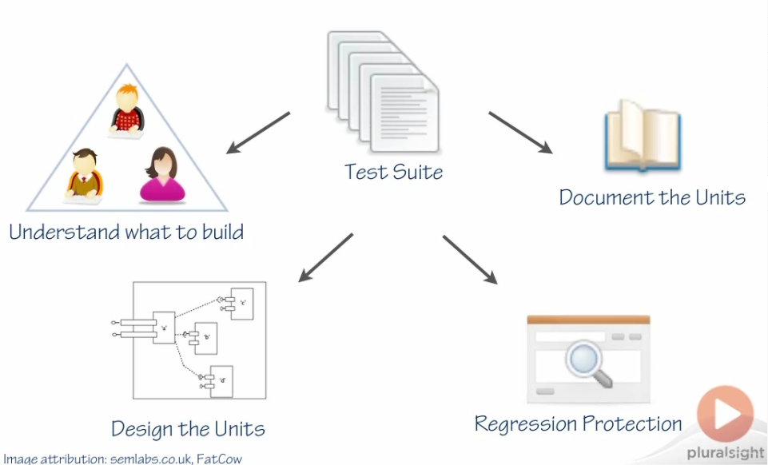
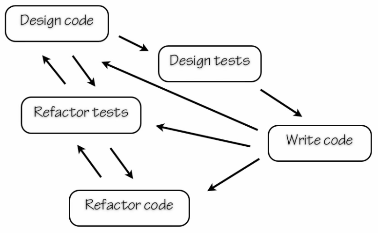
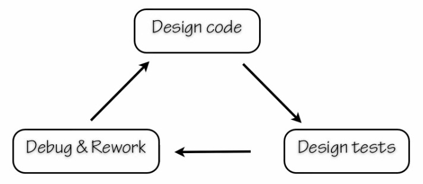
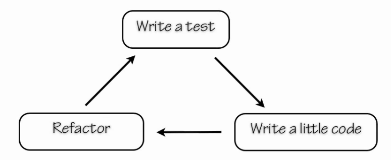

# Course Summary

- Unit testing vocabulary & basic example using `unittest`
- Unit test - why and when
- An alternative to `unittest`: `pytest`
- Testable documentation using `doctest`
- Test doubles
- Assessing test suite coverage
- Maintainable unit tests

# Module Summary

- Unit testing vocabulary & "Phoneback" example
    - test suite
    - test case
    - test runner
- Test case design

# Review of Fundamentals

### System Under Test

- a unit test checks the behavior of an **element of code**
    - a method or function
    - a module or class

- an automated test
    - designed by a human
    - runs without intervention
    - report results unambiguously as "pass" or "fail"

- it's not a unit test if it uses
    - the file system
    - a database
    - the network

# Exercise - Phone Numbers

- Given a list of names and phone numbers, make a Phonebook that allows you to look up numbers by name

- Determine if a given Phonebook is consistent
    - In a consistent phone list, no number is a prefix of another
        - `Bob          91125436`
        - `Alice        97 625 922`
        - `Emergency    911
    - Bob and Emergency are inconsistent!
    
    
***

# What is Unit Testing For?

## Understanding

- Collaborate with people in other roles to understand what's needed
    - Business Analyst, Product Owner
    - Tester
    - Interaction Designer
    - Lead Developer

## Documenting

- "Executable Specification"
    - Tests document the behavior of the code
    - How the unit is intended to be used

## Design

- Decompose the problem into units that are independently testable
    - loose coupling
- Design the interface separately from doing the implementation

## Regression Protection

- **Regression** - something worked before and doesn't anymore
    - A unit test should fail and point out which unit failed and why

# Limitations of Unit Testing

- Cannot guarantee that software is 100% bug-free
- Testing can't find all the errors and prove correctness
- Unit testing won't find integration errors

# Personal Development Process

## Test First

- Design Code $\rightarrow$ Design Tests $\rightarrow$ Write Code
    - Forces to design a testable interface before investment in implementation
    - Helps cover the important behaviors with test cases
- Risk: Rework

## Test Last

- Code first, design tests later
- Build automated regression tests
- Risk: discover testability problems and bugs late in the processfo
    - Example: Not suitable for `TelemetryDiagnosticControls` because of lack of testability (had to change constructor function)
- Risk: you'll rush or skip designing the tests
- Design Code $\rightarrow$ Design Tests $\rightarrow$ Debug & Rework $\rightarrow$ Design Code $\rightarrow$ Cycle Continues ...

## Test Driven

# Unit Testing in the Wider Development Process

<http://www.martinfowler.com/articles/continuousIntegration.html>